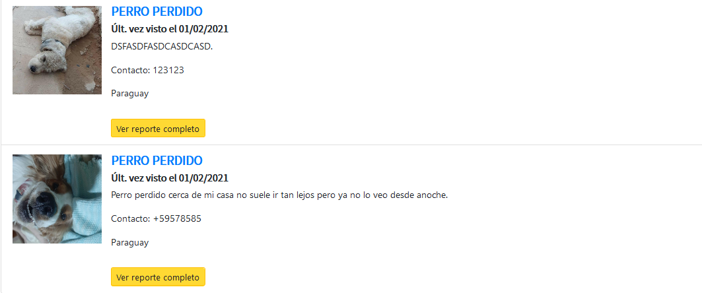
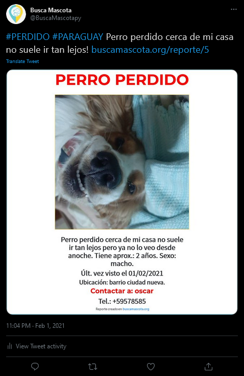

# Busca Mascota
## Qué es Busca Mascota?
Es una plataforma para ayudar a mascotas perdidas a reencontrarse con sus dueños, de una manera distinta y más eficiente.

Se crean reportes de mascotas perdidas, encontradas o avistadas a partir de un formulario, se publica la información del reporte con la ubicación en el mapa en la zona o lugar donde se vio al animal por última vez, se publica este reporte en las redes sociales oficiales de la plataforma (Twitter al instante y facebook e instagram un tiempo después), se crea una imagen con la información del reporte la cuál se puede descargar y así poder enviar por whatsapp u otros medios, el reporte queda guardado y se puede encontrar en la parte de búsquedas ya sea buscando en la vista de mapa o en la vista de lista con filtros para reducir la cantidad de reportes.

Todo esto es totalmente gratis y para facilitar la búsqueda de las mascotas, el código está abierto para cualquier contribución u otra implementación y también se puede colaborar de [muchas otras formas](http://buscammascota.org/colaborar) para mantener la plataforma activa y funcionando siempre.

## Gracias / Contribuciones
* Ximena Gonzalez
* Lujan Gonzalez
* Maria Ferreira
* Uri Yael
* Ricardo Dos Santos
* Jorge Saldivar

## Screenshots

## TODO
* Agregar filtros en busqueda de reportes (rango de fecha, pais, ciudad) ✅
* Hacer que funcione los filtros de la busqueda ✅
* Hacer pagina de colaboraciones ✅
* Hacer vistas de cuando ve el reporte completo ✅
* Controlar publicaciones que no pueda acceder varias veces ✅
* Solucionar que las views puedan cambiar y mantenerse cuando se clicka en alguna de ellas ✅
* En admin que pueda cambiar la publicacion de allowed a False ✅
* Agregar Google Analytics ✅
* Agregar logger
* Agregar que pueda reportarse las publicaciones
* Crear contenedor para probar (docker) ✅
* Improve doc ✅
* crear pip requirements ✅

## Technologies
* Python 3.8
* Django 3.1
* Postgresql 1x
* venv

## Instalacion / Installation (Ubuntu 18.04)
* `sudo apt-get update`
* `sudo apt-get install python3-pip libpq-dev postgresql postgresql-contrib python3-venv`
* `sudo passwd postgres` cambiar contraseña.
* `su - postgres psql` iniciamos sesion en el usuario de postgres y accedemos a la consola psql.
* `CREATE DATABASE buscamascota;` esto es en la consola psql para crear la base de datos.
* `CREATE USER myuser WITH PASSWORD 'password';` para crear usuario (guardar datos para poner en archivo .env).
* `GRANT ALL PRIVILEGES ON DATABASE buscamascota TO myuser;` damos privilegios al usuario que creamos.
* `\q` salimos de la consola psql.
* `logout` salimos de usuario postgres.
* `python3 -m venv NAMEPROJECT` creamos un virtual enviroment.
* `source NAMEPROJECT/bin/activate` activamos el virtual enviroment.
* `git clone https://github.com/OscarGonzalez97/buscamascota.git`
* `cd buscamascota`
* `git checkout -b origin develop`
* `chmod +x scripts/prepare.sh`
* `./scripts/prepare.sh`
* Completar archivo .env con toda las variables creadas en pasos anteriores.
* `pip3 install -r requirements.txt`
* `python3 manage.py migrate`
* `python3 manage.py runserver`
* Ir a la dirección indicada y usar la aplicación.